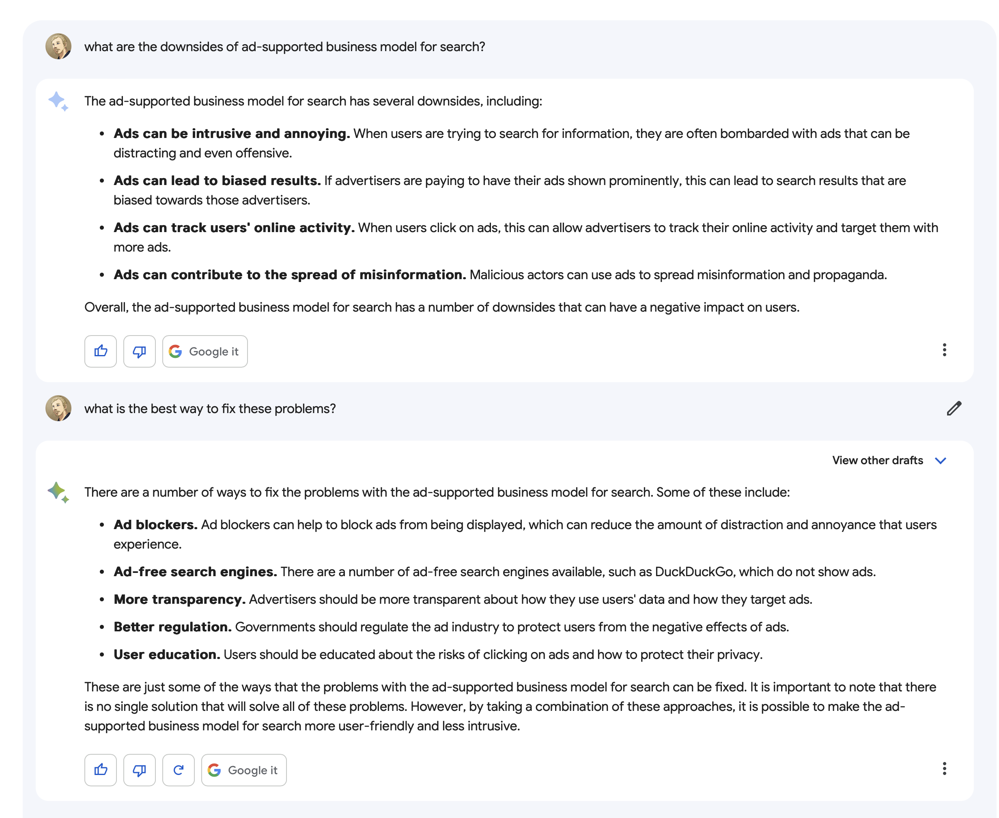

# Why Pay for Search

We'll let Google explain this (click to enlarge). This is the actual output from Google Bard AI tool (and it gets [better](https://twitter.com/MIBElashri/status/1640947867949973504)).

By charging a nominal fee for searches, Kagi ensures that its search results are faster, more accurate, and completely respectful of
user's privacy.

And by aligning our incentives with those of our users, Kagi is committed to building a better, more ethical future
on the web..

You can learn more in [The Age of PageRank is Over](https://blog.kagi.com/age-pagerank-over) post on our blog.

## Ad-Supported Search Engines & The Future of the Web

We will let no other than the founders of Google explain this. The year is 1998, and this is how they describe why it is imperative for search engines to be ad-free:

> "Currently, the predominant business model for commercial search engines is advertising. The goals of the advertising business model do not always correspond to providing quality search to users. For example, in our prototype search engine one of the top results for cellular phone is "The Effect of Cellular Phone Use Upon Driver Attention", a study which explains in great detail the distractions and risk associated with conversing on a cell phone while driving. This search result came up first because of its high importance as judged by the PageRank algorithm, an approximation of citation importance on the web [Page, 98].*
>
> It is clear that a search engine which was taking money for showing cellular phone ads would have difficulty justifying the page that our system returned to its paying advertisers. For this type of reason and historical experience with other media [Bagdikian 83], we expect that advertising funded search engines will be inherently biased towards the advertisers and away from the needs of the consumers."
>
> — [The Anatomy of a Large-Scale Hypertextual Web Search Engine](http://infolab.stanford.edu/pub/papers/google.pdf), Sergey Brin and Lawrence Page, 1998

They were right in recognizing early on that ad-supported search engines will be biased towards the advertisers. They probably could not foresee how much damage to the web adopting the model they originally criticized would ultimately cause.

## Ad-Supported Search Engines & How You Currently Pay for Search

The search results in "free" search engines are substantially impacted by advertisers and affiliate links that pay them to influence your results. The cost is not free, you are paying with your time and cognitive bandwidth required to parse the results to find what is actually relevant. Consider how much time you spend scrolling through initial results to pass over the results you know are meaningless. Also consider the personal information you are sharing and losing control of as you use the search services that present themselves as free.  

## Kagi Strives to Lower Cost

All search engines have search costs, development costs, and administrative costs. Most search engines cover this by advertising, tracking, and selling your data. Currently Kagi charges about USD 1.5 cents per search and allows most people to use a paid search engine that has their best interest in mind for just $5/mo nominal fee.

## The Numbers Tell a Tale

In 2022 Google generated USD $224.47 Billion dollars from advertisement revenue while processing approximately 8 Billion searches per day. At 365 days per year this amounts to approximately USD $0.07 revenue per search. If an average user searches 5 times per day, assuming a 30 day month this results in Google generating USD $11 revenue per user per month. However the value you receive is well below USD $11 because your results are influenced by ads. Choosing to subscribe to Kagi means that while you are now paying for search you are getting a fair value for your money, you are getting more relevant results, are able to personalize your experience and take advantage of AI tools all while protecting your and your family's privacy and data.

## Learn how to Pick a Plan

We make it easy to pick the plan that is right for you, take a look at our [Plan Types](./plan-types.md) and review our [Pick The Right Plan](./pick-the-plan.md).
